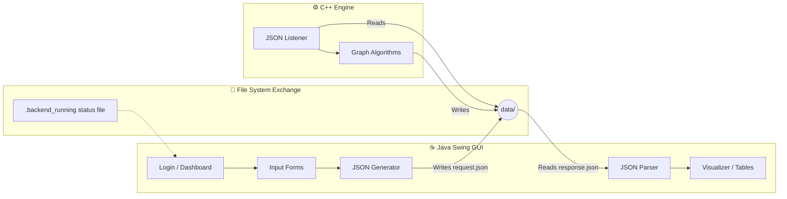

<div align="center">

# 🕵️‍♂️ Crime Network Analyzer

### _Uncover the Hidden Links in Criminal Organizations_

[](https://www.java.com/)
[](https://isocpp.org/)
[](https://maven.apache.org/)
[](#)

<br/>

```
    ╔══════════════════════════════════════════════════════╗
    ║                                                      ║
    ║        👤 ────❓──── 📍 ────❓──── 👤               ║
    ║        │              │              │               ║
    ║        ❓             ❓             ❓              ║
    ║        │              │              │               ║
    ║        📍 ────❓──── 👤 ────❓──── 📍               ║
    ║                                                      ║
    ║       Connect the dots. Solve the impossible.        ║
    ╚══════════════════════════════════════════════════════╝
```

<br/>

> 🔍 A **hybrid software system** featuring a rich **Java Swing Graphical Interface** powered by a high-performance **C++ analysis backend**. This application is designed for law enforcement to map, track, and analyze complex criminal networks, suspects, and case hierarchies.

---

[Features](#-features) •
[Architecture](#-system-architecture) •
[Tech Stack](#-tech-stack) •
[Setup](#-quick-start) •
[Usage](#-usage-guide)

</div>

---

## ✨ Features

<table>
<tr>
<td width="50%">

### 🔐 Role-Based Access Control
- **Admin Role:** Full system access (Manage Officers, Global Case Hierarchy, Add Entities).
- **Officer Role:** Focused dashboard for assigned cases and network viewing.
- Secure login portal integrated seamlessly into the application flow.

### 🕸️ Network Graph Management
- **Add Suspects & Locations:** Feed raw intelligence into the system.
- **Map Connections:** Link suspects to locations or other individuals to build the investigative web.

</td>
<td width="50%">

### 🧠 High-Performance Analysis
- Relies on a compiled **C++ backend engine** for heavy algorithmic lifting.
- Analyzes network density, central figures, and isolated clusters.
- Fast inter-process communication (IPC) via JSON payload exchange.

### 📊 Case Management
- View **Case Hierarchies** to understand chains of command.
- Dedicated **Officer Dashboard** tracking active assignments, priorities, and statuses.

</td>
</tr>
</table>

---

## 🏗️ System Architecture

The application uses a decoupled hybrid architecture, allowing the UI to remain responsive while complex graph algorithms are processed rapidly in native C++.



---

## 🛠️ Tech Stack

<div align="center">

| Component | Technology | Purpose |
|:---|:---|:---|
| **Frontend Framework** | Java Swing / AWT | Desktop GUI, interactive dashboards, event handling |
| **Backend Engine** | C++ | Graph analytics and high-speed data processing |
| **Build System** | Apache Maven | Dependency management (`pom.xml`) |
| **Data Exchange** | JSON | Standardized schema for Java ↔ C++ communication |
| **IDE** | NetBeans | Project configuration (`nbactions.xml`) |

</div>

---

## 🚀 Quick Start

Because this system relies on a compiled C++ backend to function correctly, follow these setup steps carefully.

### Prerequisites
- **Java JDK 8+** (For the Frontend)
- **Apache Maven** (For building the Java project)
- **C++ Compiler** (e.g., `g++`, `MinGW` on Windows)

### Installation & Execution

**1. Clone the repository**
```bash
git clone https://github.com/hussnainahmedd/CrimeNetworkAnalyzer.git
cd CrimeNetworkAnalyzer
```

**2. Compile and Start the C++ Backend**
You must start the backend *before* running the Java GUI.
```bash
# Compile the C++ backend source (replace with actual filename if different)
g++ CrimeNetworkBackend.cpp -o backend

# Run the backend process
./backend       # On Linux/Mac
backend.exe     # On Windows
```
*(The backend will create a `.backend_running` file in the `data/` directory to signal the GUI).*

**3. Compile and Run the Java Frontend**
In a new terminal window:
```bash
mvn clean install
mvn exec:java -Dexec.mainClass="CrimeNetworkAnalyzer"
```

---

## 📖 Usage Guide

1. **Launch Sequence:** Always ensure the C++ backend is running in the background. If the Java app detects the backend is missing, it will display a warning prompt.
2. **Login:** Use appropriate credentials. Your role (Admin vs. Officer) determines your visible tabs.
3. **Data Entry (Admin):** Navigate to the **Add Suspect** or **Add Crime Location** tabs to populate the database. Use the **Add Connection** tab to link them.
4. **Analysis:** Click the **Analyze Network** tab. The Java app will bundle the current graph state into `request.json`, trigger the C++ backend, and display the results read from `response.json`.

---

## 🤝 Contributing

1. **Fork** the repository
2. **Create** a feature branch (`git checkout -b feature/investigation-tool`)
3. **Commit** your changes (`git commit -m '✨ Add new analytics tool'`)
4. **Push** to the branch (`git push origin feature/investigation-tool`)
5. **Open** a Pull Request

---

<div align="center">

**⭐ Star this repo if you found it useful!**

<br/>

Built with ☕ Java, ⚙️ C++, and 🕵️‍♂️ Intelligence.

</div>
